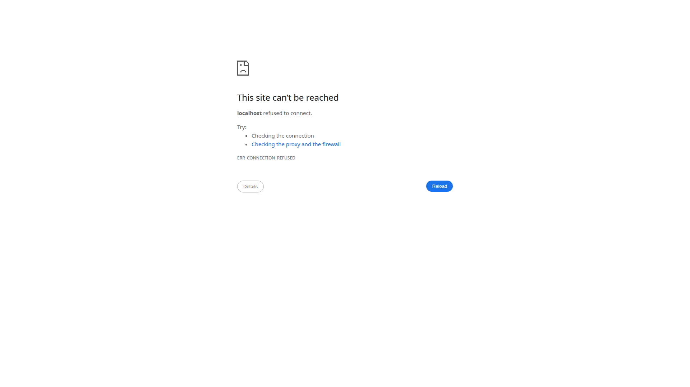

# Beanflow Payroll

> Free payroll software for Canadian small businesses. Save $500+/year.

[](https://www.gnu.org/licenses/agpl-3.0)

**Set up payroll in 90 seconds. No accounting degree needed. 100% free.**

Beanflow Payroll is a complete payroll solution designed for Canadian small business owners — not developers. Handle employee payroll, calculate CPP/EI, manage taxes, and stay CRA-compliant with an intuitive, modern interface.

[🎬 Watch: Set Up Payroll in 90 Seconds](https://youtu.be/_yjmnaa1wk8)

---

## Why Small Business Owners Love Beanflow

| What You Want | What Beanflow Delivers |
|---------------|------------------------|
| **Save Money** | Stop paying $20-45/month for payroll software |
| **Save Time** | Set up in 90 seconds, not 90 minutes |
| **Stay Compliant** | Accurate CPP, EI, and tax calculations for all provinces |
| **Peace of Mind** | Open-source means no hidden fees or surprise charges |
| **Your Data, Your Control** | Self-hosted — your payroll data stays on your infrastructure |

---

## What You Can Do

### 💼 Run Payroll in Minutes
- Add employees and their tax info in seconds
- Process payroll for weekly, bi-weekly, semi-monthly, or monthly schedules
- Automatic year-to-date tracking — no more manual calculations

### 📋 Generate Paystubs & Reports
- Create professional, CRA-compliant paystubs (PDF)
- Generate payroll registers and remittance reports
- Track vacation and leave balances

### 🇨🇦 Built for Canada
- Supports all provinces and territories (AB, BC, MB, NB, NL, NT, NS, NU, ON, PE, SK, YT)
- Accurate CPP (including CPP2), EI, and federal/provincial tax calculations
- T4 slips and year-end processing included
- ROE generation ready

### 👥 Employee Self-Service
- Employees can view and download their own paystubs
- Update personal and tax information directly
- Check vacation and leave balances anytime

---

## See It in Action

### 📸 Product Screenshots

| | |
|---|---|
| **Dashboard** — Overview of your payroll at a glance |  |
| **Employee Management** — Add and manage employees easily |  |
| **Payroll Run** — Process payroll in just a few clicks |  |
| **Paystub View** — Professional, CRA-compliant paystubs |  |
| **Reports** — Payroll registers and remittance tracking |  |

> 💡 **Note:** These screenshots show the current interface. We're continuously improving the experience!

---

## How It Compares

| | Beanflow Payroll | Wagepoint | Wave Payroll | QuickBooks |
|---|------------------|-----------|--------------|------------|
| **Monthly Cost** | **$0** | $20 + $4/emp | $20 + $6/emp | $45 + $5/emp |
| **Setup Time** | **90 seconds** | 15-30 min | 30-60 min | 1-2 hours |
| **Canadian Tax** | ✅ All provinces | ✅ Most | ✅ Most | ✅ Most |
| **Open Source** | ✅ Yes | ❌ No | ❌ No | ❌ No |
| **Self-Hosted** | ✅ Yes | ❌ No | ❌ No | ❌ No |

---

## Getting Started

### Try It Free — No Credit Card Required

1. **Clone the repository**
   ```bash
   git clone https://github.com/beanflow/payroll.git
   cd payroll
   ```

2. **Run the setup script**
   ```bash
   ./start-dev.sh
   ```

3. **Open your browser**
   Visit `http://localhost:5173` to start using Beanflow Payroll.

> 📖 **Need help?** [Watch our 90-second setup video](https://youtu.be/_yjmnaa1wk8) or read the [full documentation](docs/).

---

## Supported Provinces

Beanflow Payroll supports all Canadian provinces and territories:

- Alberta (AB) • British Columbia (BC) • Manitoba (MB)
- New Brunswick (NB) • Newfoundland and Labrador (NL)
- Northwest Territories (NT) • Nova Scotia (NS) • Nunavut (NU)
- Ontario (ON) • Prince Edward Island (PE)
- Saskatchewan (SK) • Yukon (YT)

> **Quebec (QC)** — Support is planned for a future release due to Quebec's unique tax system (QPP and QST).

---

## Roadmap — All Features Complete

| Phase | Feature | Status |
|-------|---------|--------|
| 1 | Data Layer & Schema | ✅ Complete |
| 2 | Payroll Calculations | ✅ Complete |
| 3 | Paystub PDF Generation | ✅ Complete |
| 4 | API Integration | ✅ Complete |
| 5 | Testing & Validation | ✅ Complete |
| 6 | T4 Year-End Processing | ✅ Complete |
| 7 | ROE Generation | ✅ Complete |
| 8 | Quebec Support | 📅 Planned |

---

## For Developers

Beanflow Payroll is built with modern, reliable technologies:

- **Frontend:** Svelte 5, SvelteKit, TypeScript, TailwindCSS
- **Backend:** Python 3.11+, FastAPI, Pydantic
- **Database:** Supabase (Postabase)
- **Auth:** Supabase Auth (Google OAuth)

Interested in contributing? We'd love your help! See [CONTRIBUTING.md](CONTRIBUTING.md) for guidelines.

---

## License

This project is licensed under the **GNU Affero General Public License v3.0 (AGPL-3.0)**.

You are free to use, modify, and distribute this software. If you use Beanflow Payroll to provide a service over a network, you must provide the source code to your users.

---

## Get Help

- **Documentation:** [docs/](docs/)
- **YouTube:** [@Beanflow-ai](https://www.youtube.com/@Beanflow-ai)
- **Issues:** [GitHub Issues](https://github.com/beanflow/payroll/issues)
- **Discussions:** [GitHub Discussions](https://github.com/beanflow/payroll/discussions)

---

**Made with ❤️ for Canadian small business owners.**
